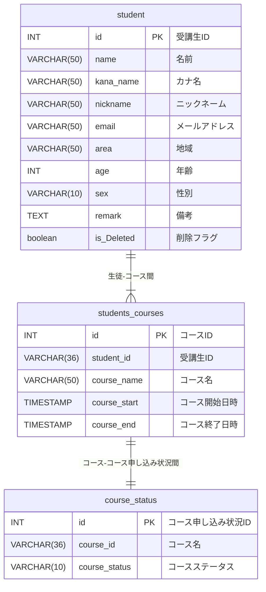

```mermaid
erDiagram
    student {
        INT id PK "受講生ID"
        VARCHAR(50) name "名前"
        VARCHAR(50) kana_name "カナ名"
        VARCHAR(50) nickname "ニックネーム"
        VARCHAR(50) email "メールアドレス"
        VARCHAR(50) area "地域"
        INT age "年齢"
        VARCHAR(10) sex "性別"
        TEXT remark "備考"
        boolean is_Deleted "削除フラグ"
    }
    students_courses {
        INT id PK "コースID"
        VARCHAR(36) student_id "受講生ID"
        VARCHAR(50) course_name "コース名"
        TIMESTAMP course_start "コース開始日時"
        TIMESTAMP course_end "コース終了日時"
    }
    course_status {
        INT id PK "コース申し込み状況ID"
        VARCHAR(36) course_id "コース名"
        VARCHAR(10) course_status "コースステータス"
    }
    student ||--|{ students_courses: "生徒-コース間"
    students_courses ||--|| course_status: "コース-コース申し込み状況間"
```